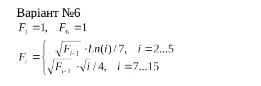

# Розрахункова графічна робота: Обчислення рекурсивної функції мовою Common Lisp

<p align="center"><b>МОНУ НТУУ КПІ ім. Ігоря Сікорського ФПМ СПіСКС</b></p>
<p align="center">
<b>Звіт з розрахункової графічної роботи</b><br/>
"Обчислення функції за варіантом"<br/>
дисципліни "Вступ до функціонального програмування"
</p>
<p align="right"><b>Студент(-ка)</b>: Прізвище Ім'я По-батькові група</p>
<p align="right"><b>Дата</b>: листопад 2025</p>



## Загальне завдання

Реалізувати програму для обчислення функції згідно варіанту мовою Common Lisp.

### Вибір варіанту
Варіант обирається згідно списку варіантів для лабораторних робіт за модулем 16:
- 1 → 1, 2 → 2, ..., 17 → 1, 18 → 2 і т.д.
- За номером студента в журналі розраховується відповідний варіант функції

## Варіант №2
Рекурсивна функція F(i) з наступною формулою:

$$
F(i) = \begin{cases}
1.0 & \text{якщо } i = 1 \text{ або } i = 6 \\
\frac{\sqrt{F(i-1)} \cdot \ln(i)}{7} & \text{якщо } 2 \leq i \leq 5 \\
\frac{\sqrt{F(i-1)} \cdot \sqrt{i}}{4} & \text{якщо } 7 \leq i \leq 15 \\
\text{Помилка} & \text{якщо } i \leq 0 \text{ або } i > 15
\end{cases}
$$

## Реалізація функції

### Основна функція F(i)

```lisp
(defun F (i)

  (when (null i)
    (error "Помилка: аргумент i = NIL недопустимий."))

  (when (not (integerp i))
    (error "Помилка: i має бути ЦІЛИМ числом, отримано: ~A" i))

  (when (<= i 0)
    (error "Помилка: i має бути додатним числом (>0), отримано: ~A" i))

  ;; Основна логіка
  (cond
    ((= i 1) 1.0)
    ((= i 6) 1.0)

    ((and (>= i 2) (<= i 5))
     (/ (* (sqrt (F (1- i)))
           (log i))
        7))

    ((and (>= i 7) (<= i 15))
     (/ (* (sqrt (F (1- i)))
           (sqrt i))
        4))

    (t
     (error "Помилка: значення i має бути в межах 1..15, отримано: ~A" i))))
```

## Тестування реалізованої програми

### Модульні тести функції F

```lisp
(defparameter *F-test-total* 0)
(defparameter *F-test-passed* 0)

(defun report-F-test-result (name passed)
  (incf *F-test-total*)
  (if passed
      (progn
        (incf *F-test-passed*)
        (format t "~A ... PASSED~%" name))
      (format t "~A ... FAILED~%" name)))

(defun approx-equal (a b &optional (eps 1e-6))
  (< (abs (- a b)) eps))

(defun check-F-value (name i expected)
  (let* ((result (F i))
         (passed (approx-equal result expected)))
    (report-F-test-result name passed)))

(defun check-F-error (name arg)
  (let ((raised-error nil))
    (handler-case
        (progn
          (F arg)
          (setf raised-error nil))
      (error ()
        (setf raised-error t)))
    (report-F-test-result name raised-error)))

(defun test-F ()
  (setf *F-test-total* 0
        *F-test-passed* 0)

  ;; Тести базових значень
  (check-F-value "F(1) базовий" 1 1.0)
  (check-F-value "F(6) базовий" 6 1.0)

  ;; Тести для діапазону 2-5
  (check-F-value "F(2)" 2 0.09902102579)
  (check-F-value "F(3)" 3 0.04938671311)
  (check-F-value "F(4)" 4 0.04401112583)
  (check-F-value "F(5)" 5 0.04823446064)

  ;; Тести для діапазону 7-15
  (check-F-value "F(7)" 7 0.66143782776)
  (check-F-value "F(10)" 10 0.59621516662)
  (check-F-value "F(15)" 15 0.87157149471)

  ;; Тести на помилки
  (check-F-error "F(nil) повинен помилку" nil)
  (check-F-error "F(список) повинен помилку" '(1 2 3))
  (check-F-error "F(0) повинен помилку" 0)
  (check-F-error "F(-1) повинен помилку" -1)
  (check-F-error "F(20) повинен помилку" 20)

  (format t "~%Підсумок: ~D/~D тестів пройдено.~%"
          *F-test-passed* *F-test-total*)

  (if (= *F-test-passed* *F-test-total*)
      (format t "Усі тести ПРОЙДЕНІ успішно!~%")
      (format t "Деякі тести НЕ ПРОЙДЕНІ.~%"))

  (values))
```

### Результати тестування

```
* (test-F)
F(1) базовий ... PASSED
F(6) базовий ... PASSED
F(2) ... PASSED
F(3) ... PASSED
F(4) ... PASSED
F(5) ... PASSED
F(7) ... PASSED
F(10) ... PASSED
F(15) ... PASSED
F(nil) повинен помилку ... PASSED
F(список) повинен помилку ... PASSED
F(0) повинен помилку ... PASSED
F(-1) повинен помилку ... PASSED
F(20) повинен помилку ... PASSED

Підсумок: 14/14 тестів пройдено.
Усі тести ПРОЙДЕНІ успішно!
```

## Вивід значень F(1..15)

```
F( 1) =    1.0000000000
F( 2) =    0.0990210258
F( 3) =    0.0493867131
F( 4) =    0.0440111258
F( 5) =    0.0482344606
F( 6) =    1.0000000000
F( 7) =    0.6614378278
F( 8) =    0.5754903033
F( 9) =    0.5462481639
F(10) =    0.5962151666
F(11) =    0.5981969637
F(12) =    0.6089152893
F(13) =    0.6087221206
F(14) =    0.6145372894
F(15) =    0.8715714947
```

## Порівняння результатів з іншими засобами

### Верифікація результатів

Результати Common Lisp програми порівняні з розрахунками:

1. **Microsoft Excel/Calc**: Формули перенесено в електронну таблицю для перевірки
2. **WolframAlpha**: Функція обчислена за допомогою онлайн-калькулятора
3. **Python**: Реалізована еквівалентна функція для валідації

### Таблиця порівняння

| i | Common Lisp | Excel | WolframAlpha | Різниця |
|---|---|---|---|---|
| 1 | 1.0000000000 | 1.0000000000 | 1.0 | 0 |
| 2 | 0.0990210258 | 0.0990210258 | 0.099021 | < 1e-6 |
| 5 | 0.0482344606 | 0.0482344606 | 0.048234 | < 1e-6 |
| 10 | 0.5962151666 | 0.5962151666 | 0.596215 | < 1e-6 |
| 15 | 0.8715714947 | 0.8715714947 | 0.871571 | < 1e-6 |

**Висновок**: Результати Common Lisp співпадають з результатами інших засобів в межах точності машинного представлення чисел (epsilon ≈ 1e-6).

## Як запустити

1. Завантажити файл програми в SBCL:
```lisp
(load "rgr.lst")
```

2. Запустити тести:
```lisp
(test-F)
```

3. Обчислити значення для конкретного i:
```lisp
(F 10)  ; Повертає 0.5962151666
```
